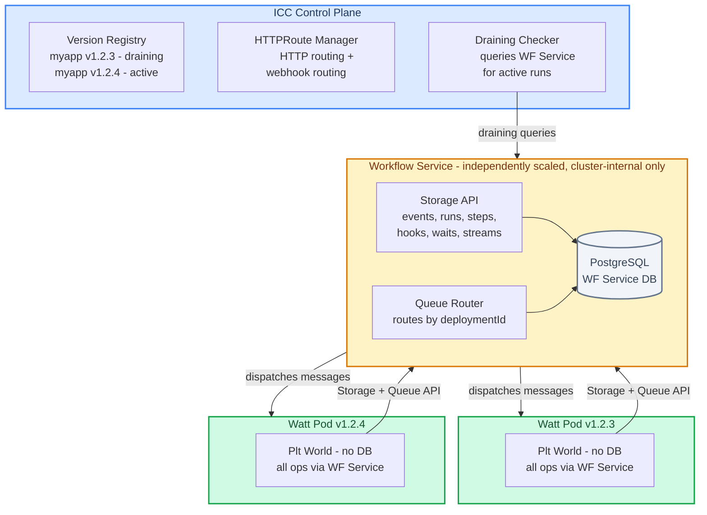
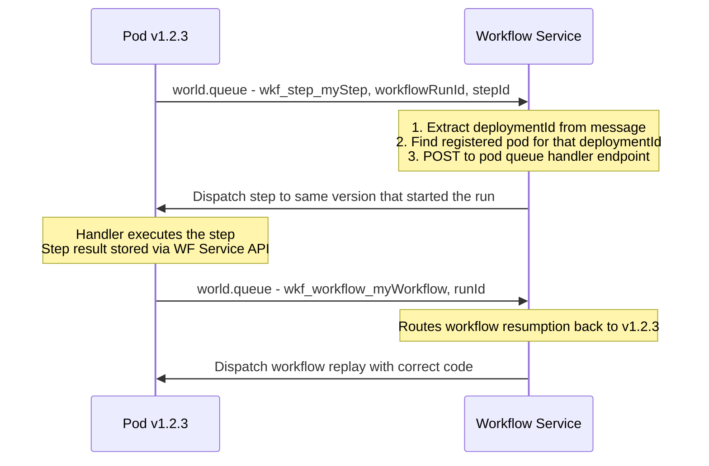
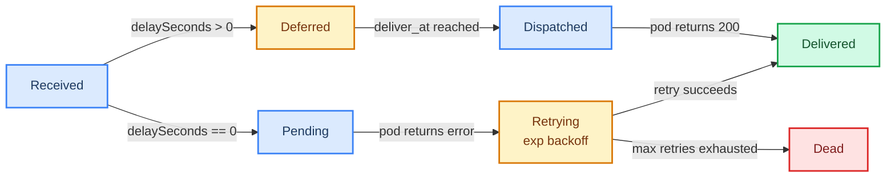
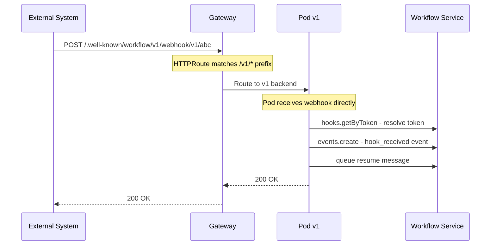
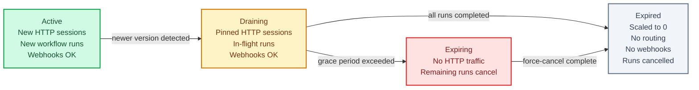

# Platformatic World: Design Document

**Status:** Active
**Last Updated:** March 2026

---

## 1. Problem Statement

Workflow DevKit uses deterministic replay: when a workflow resumes, it re-executes from the beginning, matching steps to cached results by position-based correlationIds. This works correctly only when the workflow code is the same version that started the run. See [UPGRADE-SEMANTICS.md](./UPGRADE-SEMANTICS.md) for the full analysis of the replay model and which code changes are safe or unsafe across deployments.

| World | Durable State | Deployment-Aware Routing | Safe Upgrades |
|---|---|---|---|
| Local | No | N/A | Safe by isolation (no state survives) |
| Postgres | Yes | No | Unsafe — new code replays old events |
| Vercel | Yes | Yes (Vercel infrastructure) | Safe |

**Goal:** Create a `PlatformaticWorld` that provides the safety of the Vercel world in self-hosted Kubernetes environments, using the same skew protection principles that ICC already implements for HTTP traffic.

---

## 2. Key Insight: Workflow Runs Are Sessions

ICC's skew protection solves exactly this problem for HTTP requests: when a user starts a session on version N, all subsequent requests continue on version N via cookie-based routing through the Gateway API.

Workflow runs have the same property. A run started on version N must continue executing on version N until it reaches a terminal state. The `deploymentId` stored in every `run_created` event is the equivalent of the `__plt_dpl` cookie — it identifies which deployment version owns that run.

The difference is the transport: HTTP requests flow through the Gateway API, but workflow queue messages flow through the World's queue system. The Platformatic World needs to apply the same version-pinning to queue messages that ICC's HTTPRoute rules apply to HTTP requests.

---

## 3. Design Rationale

### 3.1 Why All Operations Go Through a Central Service

The first design we considered split responsibilities: pods access Postgres directly for storage, ICC handles queue routing only. This approach failed because ICC could not safely determine when a deployment version had no in-flight workflow runs — making version decommissioning unreliable.

The workflow runtime has three suspension primitives with different visibility characteristics:

| Suspension Type | Queue Message? | Pod Heartbeat? | Resume Mechanism |
|---|---|---|---|
| **Step execution** | Yes | Yes (pod executing) | Queue dispatch |
| **Sleep / Wait** | No (event only) | No (pod idle) | Timer → `wait_completed` event → re-queue |
| **Hook / Webhook** | No (event only) | No (pod idle) | External HTTP → `hook_received` event → re-queue |

Steps are fully visible — they produce queue messages and execute on pods. But hooks and waits are invisible: they write events to the app's Postgres and then the pod finishes. No queue message exists. No pod has the run in memory. The run is suspended indefinitely (hooks) or until a future time (waits), waiting for an external trigger.

This creates three concrete failure modes in the split design:

**Gap 1: Webhook-suspended runs are invisible.** A workflow registers a webhook and suspends. The pod finishes — nothing in memory, no heartbeat signal, no queue message. ICC sees zero RPS, zero heartbeat-reported runs, zero pending queue messages — and concludes the version is safe to expire. When the webhook arrives hours later via HTTP, the Gateway routes it to the active version's pod (external callers don't have session cookies). That pod looks up the token in Postgres, finds the run belongs to an expired version — but the version's pods are scaled to zero. The run is unrecoverable.

**Gap 2: Orphaned runs after pod crashes.** A pod crashes mid-replay, before reaching the suspension handler. The consumed queue message is gone, the pod is dead, no heartbeat. The run is stuck in `running` status forever with no way to resume. No retry will happen because no message exists.

**Gap 3: Inaccurate draining decisions.** Heartbeats only track actively-executing runs. Suspended runs (waiting for webhooks or timers) are not "active" on any pod. When ICC scales a draining version to zero replicas, all heartbeat visibility is lost.

ICC's draining checker must answer: "Are there any non-terminal workflow runs for deployment version X?" In the split design, ICC cannot answer this question reliably. It can only approximate via queue messages (misses hooks and waits) and pod heartbeats (misses suspended runs, stale after crashes). The only authoritative source is the workflow runs table — which ICC does not have access to.

Several patches to the split design were considered:

- **Pods report suspended runs in heartbeats.** But pods don't know about runs they haven't recently executed. A suspended run from before a pod restart is invisible.
- **ICC checks its queue table for pending/deferred messages.** Covers steps and sleeps, but not hooks (hooks create no queue message).
- **Pods register hooks with ICC via a new API.** Possible, but adds a coordination point and moves ICC closer to owning storage anyway.
- **Webhook endpoints route through a central service.** A service maintains a hook registry and resolves `token → run → deploymentId`. This is exactly what the final design does.

Each patch moves the split design closer to centralizing all workflow state. The fundamental issue is that safe decommissioning requires authoritative knowledge of all non-terminal runs, and that knowledge must live in a single, accessible place.

### 3.2 Why the Service Is Separate from ICC

The next iteration we considered bundled all workflow operations directly into ICC. This solved the visibility problem but introduced a scalability concern: ICC is a control plane (version registry, HTTPRoute management, autoscaling, draining). Adding high-throughput workflow CRUD turns it into a data plane too, and the two have very different scaling characteristics.

A control plane handles infrequent, high-impact operations (version detection, route updates, scaling decisions). A workflow data plane handles frequent, high-throughput operations (event writes on every step, event reads on every replay, queue dispatches). Bundling both into one process means workflow throughput is constrained by control plane resources, and control plane stability is affected by workflow load spikes.

The solution is a separate Workflow Service — independently scalable, focused on workflow CRUD and queue routing, managed by ICC as cluster infrastructure.

---

## 4. Architecture



**Three-tier separation:**

- **ICC (control plane):** Version registry, HTTPRoute management (including webhook path routing), autoscaling, draining decisions. Manages the Workflow Service's lifecycle (deploys, scales, monitors). Queries the Workflow Service API for draining checks. Does **not** handle any workflow CRUD.
- **Workflow Service (data plane):** Handles all World operations — storage (events, runs, steps, hooks, waits, streams), queue routing, deferred delivery. Owns its PostgreSQL database. Scales horizontally — multiple pods can serve API requests. A **leader election** mechanism (using `@platformatic/leader` — a shared package extracted from ICC, based on `pg_try_advisory_lock` with LISTEN/NOTIFY) ensures that singleton tasks like the deferred message poller run on exactly one pod. If the leader fails, another replica acquires the lock automatically. **Cluster-internal only — never exposed to the internet.**
- **Pods (executors):** Stateless. Talk exclusively to the Workflow Service for storage/queue operations. Handle webhook HTTP endpoints directly (routed by ICC's HTTPRoute rules).

---

## 5. Key Design Decisions

- **Workflow Service owns the database.** The service manages the schema, runs migrations, and holds the connection pool. Pods never touch Postgres directly. Per-application isolation is achieved via `application_id` scoping.
- **No local queue — the Workflow Service is the sole queue system.** Every `world.queue()` call goes to the Workflow Service. It handles both immediate and deferred delivery. No graphile-worker, no in-process message broker.
- **Pods are stateless executors.** A pod receives a message from the Workflow Service, executes workflow/step code, and calls the service API to store results. If a pod dies mid-execution, the service retries the message on another pod of the same version.
- **ICC manages the service's lifecycle.** ICC deploys the Workflow Service as cluster infrastructure (like the Gateway), scales it based on load, and monitors its health. ICC does not run workflow CRUD itself.
- **ICC queries the service for draining.** For draining decisions, ICC calls the Workflow Service's draining API to get authoritative run counts per deployment version. No heartbeat estimation.
- **Credentials stay centralized.** Pods need only the Workflow Service URL and an auth token. No Postgres credentials distributed to application pods.
- **Event-driven write path.** All state changes go through a single endpoint (`POST /api/v1/apps/:appId/runs/:runId/events`). This provides a complete audit trail and centralizes validation, side effects, and error handling.
- **Binary storage for opaque data.** Step inputs, outputs, and event data are stored as `BYTEA` since the service never queries inside them. This supports encrypted payloads and avoids wasting CPU on JSON parsing.
- **Webhook routing via URL path.** Webhook URLs include the `deploymentId` as a path segment, enabling ICC to route webhooks to the correct version's pods using standard HTTPRoute path rules. The Workflow Service is never exposed to external traffic.

---

## 6. Workflow Service API

The Workflow Service exposes REST endpoints for the World interface. All app-scoped endpoints require Bearer token authentication. Admin endpoints (app management, version notification, draining) require the master key. The service is accessible only within the cluster.

### 6.1 Authentication

The service supports two authentication modes, configured via `WF_AUTH_MODE`:

- **`api-key`** (default): Pods authenticate with per-app API keys (format: `wfk_<hex>`). Keys are hashed and stored in `workflow_app_keys`.
- **`k8s-token`**: Pods authenticate with Kubernetes service account tokens. The service validates the token against the K8s API server and maps the namespace/service-account to an application via `workflow_app_k8s_bindings`.
- **`both`**: Tries API key first, falls back to K8s token.

A separate **master key** (`WF_MASTER_KEY`) is used for admin operations: creating apps, rotating keys, draining, version notification.

Public paths (`/ready`, `/status`, `/metrics`) skip authentication entirely.

### 6.2 App Management (Master Key Only)

```
POST   /api/v1/apps
  Body: { appId }
  → Creates application, returns first API key: { appId, apiKey: "wfk_..." }

POST   /api/v1/apps/:appId/keys/rotate
  → Revokes all existing keys, issues new key: { appId, apiKey: "wfk_..." }

POST   /api/v1/apps/:appId/k8s-binding
  Body: { namespace, serviceAccount }
  → Binds a K8s service account to this application

DELETE /api/v1/apps/:appId/k8s-binding
  Body: { namespace, serviceAccount }
  → Removes K8s binding
```

### 6.3 Events (Main Write Path)

All state changes flow through the events endpoint. This is the core write path for the entire system.

```
POST   /api/v1/apps/:appId/runs/:runId/events
  Body: { eventType, correlationId, eventData, specVersion }
  Query: ?resolveData=none (optional, to skip returning data blobs)
  → Creates an event and applies the corresponding state change
```

**Supported event types and their side effects:**

| Event Type | Side Effect |
|---|---|
| `run_created` | Creates a new `workflow_runs` row (status: `pending`). `runId` may be `null` (auto-generated). |
| `run_started` | Sets run status to `running`, records `started_at`. |
| `run_completed` | Sets run status to `completed`, stores output, disposes all pending hooks. |
| `run_failed` | Sets run status to `failed`, stores error, disposes all pending hooks. |
| `run_cancelled` | Sets run status to `cancelled`, disposes all pending hooks. |
| `run_expired` | Sets run status to `expired`, records `expired_at`, disposes all pending hooks. |
| `step_created` | Creates a new `workflow_steps` row (status: `pending`). |
| `step_started` | Sets step status to `running`, records attempt number. |
| `step_completed` | Sets step status to `completed`, stores result output. |
| `step_failed` | Sets step status to `failed`, stores error. |
| `step_retrying` | Resets step to `pending`, stores error and `retry_after`. |
| `hook_created` | Creates a `workflow_hooks` row. Returns `hook_conflict` event if token already exists. |
| `hook_received` | Sets hook status to `received`, records `received_at`. |
| `hook_disposed` | Sets hook status to `disposed`, records `disposed_at`. |
| `wait_created` | Creates a `workflow_waits` row (status: `waiting`) with optional `resume_at`. |
| `wait_completed` | Sets wait status to `completed`. |

Each event type is processed in a single database transaction. The response includes the created event plus the affected entity (run, step, hook, or wait).

**Response format:**
```json
{
  "event": { "eventId": "123", "runId": "...", "eventType": "step_completed", "createdAt": "..." },
  "step": { "stepId": "...", "status": "completed", "output": "..." }
}
```

```
GET    /api/v1/apps/:appId/runs/:runId/events
  Query: ?order=asc&limit=100&cursor=0&resolveData=none
  → Returns paginated events for the run (used during replay)

GET    /api/v1/apps/:appId/events/by-correlation
  Query: ?correlationId=...&limit=100&cursor=0
  → Returns events matching a correlation ID
```

### 6.4 Runs (Read-Only)

```
GET    /api/v1/apps/:appId/runs/:runId
  Query: ?resolveData=none
  → Returns run state

GET    /api/v1/apps/:appId/runs
  Query: ?status=running&deploymentId=1.2.3&workflowName=...&limit=50&cursor=...
  → Lists runs with filters, paginated by createdAt DESC
```

Runs are created and updated exclusively through events (`run_created`, `run_started`, `run_completed`, `run_failed`, `run_cancelled`, `run_expired`). There are no direct write endpoints for runs.

### 6.5 Steps (Read-Only)

```
GET    /api/v1/apps/:appId/runs/:runId/steps/:stepId
  Query: ?resolveData=none
  → Returns step state

GET    /api/v1/apps/:appId/runs/:runId/steps
  Query: ?limit=100&cursor=0&resolveData=none
  → Lists steps for a run
```

Steps are created and updated exclusively through events (`step_created`, `step_started`, `step_completed`, `step_failed`, `step_retrying`).

### 6.6 Hooks (Read-Only)

```
GET    /api/v1/apps/:appId/hooks/:hookId
  → Returns hook state

GET    /api/v1/apps/:appId/hooks/by-token/:token
  → Looks up a hook by token (used when webhook is received)

GET    /api/v1/apps/:appId/hooks
  Query: ?runId=...&limit=100&cursor=0
  → Lists non-disposed hooks
```

Hooks are created and updated exclusively through events (`hook_created`, `hook_received`, `hook_disposed`). The `workflow_hooks` table tracks the full lifecycle: `pending` → `received` → `disposed`.

### 6.7 Streams

```
PUT    /api/v1/apps/:appId/runs/:runId/streams/:name
  Body: { data } (single chunk)
  Header: x-stream-multi: true → body is array of chunks
  Header: x-stream-done: true → closes the stream
  → Writes chunk(s) to a named stream

GET    /api/v1/apps/:appId/streams/:name
  Query: ?startIndex=0
  → Reads stream chunks as binary (application/octet-stream)

GET    /api/v1/apps/:appId/runs/:runId/streams
  → Lists stream names for a run
```

### 6.8 Queue

```
POST   /api/v1/apps/:appId/queue
  Body: { queueName, message, deploymentId, idempotencyKey, delaySeconds }
  → Enqueues a message (immediate or deferred delivery)
```

**Response (immediate delivery, dispatched):**
```json
{ "messageId": "msg_42", "routedTo": "1.2.3" }
```

**Response (deferred delivery):**
```json
{ "messageId": "msg_43", "scheduled": true, "deliverAt": "2026-03-01T12:05:00Z" }
```

**Error responses:**
- `409` — Duplicate message (idempotency key already processed)
- `429` — Queue rate limit exceeded

### 6.9 Encryption

```
GET    /api/v1/apps/:appId/encryption-key?runId=...
  → Returns base64-encoded derived encryption key for a run
```

Per-app secrets are auto-generated (32 random bytes) and stored in `workflow_encryption_keys`. Per-run keys are derived via HKDF-SHA256 with the runId as salt and `"workflow-encryption"` as info. Pods receive only the derived key, never the master secret.

### 6.10 Handler Registration

```
POST   /api/v1/apps/:appId/handlers
  Body: { podId, deploymentVersion, endpoints: { workflow, step, webhook } }
  → Registers a pod's queue handler endpoints (upserts on conflict)

DELETE /api/v1/apps/:appId/handlers/:podId
  → Deregisters a pod (on shutdown)
```

When pods start, they register their queue handler endpoints with the Workflow Service. The service uses these for dispatching queue messages. Re-registration updates the existing record and refreshes the heartbeat timestamp.

### 6.11 Version Notification (Called by ICC)

```
POST   /api/v1/versions/notify
  Body: { applicationId, deploymentVersion, status: "active" | "draining" | "expired" }
  → Upserts version status in workflow_deployment_versions
```

When ICC detects a new deployment version (via Machinist/watt-extra), it notifies the Workflow Service so the service knows which versions are active, draining, or expired. This allows the service to reject queue submissions for expired versions immediately rather than attempting delivery.

### 6.12 Draining API (Called by ICC)

```
GET    /api/v1/apps/:appId/versions/:deploymentId/status
  → Returns { activeRuns, pendingHooks, pendingWaits, queuedMessages }

POST   /api/v1/apps/:appId/versions/:deploymentId/expire
  → Force-cancels all in-flight runs for this version
  → Returns { cancelledRuns, deadLetteredMessages }
```

The expire operation within a single transaction:
1. Cancels all pending/running runs for the version
2. Creates `run_cancelled` events for each cancelled run
3. Disposes hooks for cancelled runs
4. Dead-letters all pending/deferred/failed queue messages for the version
5. Deregisters all handlers for the version
6. Updates version status to `expired`

These endpoints require the master key and are called by ICC's draining checker, not by pods.

### 6.13 Dead-Letter Management

```
GET    /api/v1/apps/:appId/dead-letters
  Query: ?limit=50&cursor=0&queueName=...
  → Lists dead-lettered messages

POST   /api/v1/apps/:appId/dead-letters/:messageId/retry
  → Resets a dead-lettered message to pending for redelivery
```

### 6.14 Metrics

```
GET    /metrics
  → Prometheus-compatible metrics (text/plain)
```

Exposed metrics:
- **Counters:** `wf_events_created_total`, `wf_runs_created_total`, `wf_messages_dispatched_total`, `wf_messages_dead_lettered_total`, `wf_messages_retried_total`
- **Gauges:** `wf_active_runs`, `wf_queue_depth`, `wf_db_pool_total`, `wf_db_pool_idle`
- **Summaries:** `wf_request_duration_ms` (p50, p95, p99), `wf_queue_dispatch_duration_ms`

### 6.15 Health

```
GET    /ready   → 200 if service is ready
GET    /status  → 200 with service status
```

### 6.16 Quotas

Per-app quotas are enforced on write operations:
- **`max_runs`** (default 10,000): Maximum concurrent active runs. Checked on `run_created` events.
- **`max_events_per_run`** (default 10,000): Maximum events per run. Checked on all non-`run_created` events.
- **`max_queue_per_minute`** (default 1,000): Queue message rate limit. Checked on `POST /queue`.

Quota violations return `429 Too Many Requests`. Quotas are cached in-memory with a 60-second TTL and stored in `workflow_app_quotas`.

---

## 7. World Client Implementation

The `world-client` package (`@platformatic/world-client`) provides `createPlatformaticWorld()`, a function that returns an object satisfying the `World` interface from `@workflow/world`. It delegates all operations to the Workflow Service via HTTP.

```typescript
export function createPlatformaticWorld (config: PlatformaticWorldConfig) {
  const client = new HttpClient(config)

  return {
    ...createStorage(client),
    ...createQueue(client, config),
    ...createStreamer(client),
    getEncryptionKeyForRun: createEncryption(client),
    async close () {
      await client.close()
    },
  }
}
```

The `HttpClient` uses an undici `Pool` for connection reuse and sends Bearer token authentication on every request.

### 7.1 Storage

Composed from `createStorage(client)`, returns `runs`, `steps`, `events`, and `hooks` namespaces:

- **`events.create(runId, data, params?)`** — `POST /runs/:runId/events`. The single write path. Handles date coercion on responses.
- **`events.list(params)`** — `GET /runs/:runId/events`. Returns paginated events.
- **`events.listByCorrelationId(params)`** — `GET /events/by-correlation`. Queries by correlationId.
- **`runs.get(id, params?)`** — `GET /runs/:id`. Supports `resolveData` option.
- **`runs.list(params?)`** — `GET /runs`. Filters by workflowName, status.
- **`steps.get(runId, stepId, params?)`** — `GET /runs/:runId/steps/:stepId`.
- **`steps.list(params)`** — `GET /runs/:runId/steps`.
- **`hooks.get(hookId, params?)`** — `GET /hooks/:hookId`.
- **`hooks.getByToken(token, params?)`** — `GET /hooks/by-token/:token`.
- **`hooks.list(params)`** — `GET /hooks`.

All responses have dates coerced from ISO strings to `Date` objects (`createdAt`, `updatedAt`, `startedAt`, `completedAt`, `expiredAt`, `resumeAt`, `retryAfter`).

### 7.2 Queue

Composed from `createQueue(client, config)`, returns `queue`, `createQueueHandler`, and `getDeploymentId`:

```typescript
const queue = async (queueName, message, opts?) => {
  return client.post('/queue', {
    queueName, message,
    deploymentId: opts?.deploymentId ?? config.deploymentVersion,
    idempotencyKey: opts?.idempotencyKey,
    delaySeconds: opts?.delaySeconds,
  })
}

const createQueueHandler = (prefix, handler) => {
  return async (req: Request) => {
    const { message, meta } = await req.json()
    const result = await handler(message, meta)
    // If handler returns timeoutSeconds, re-queue with delay (sleep/wait continuation)
    if (typeof result?.timeoutSeconds === 'number') {
      await queue(meta.queueName, message, {
        deploymentId: config.deploymentVersion,
        delaySeconds: result.timeoutSeconds,
      })
    }
    return Response.json(result ?? {})
  }
}

const getDeploymentId = async () => config.deploymentVersion
```

### 7.3 Streamer

Composed from `createStreamer(client)`:

- **`writeToStream(name, runId, chunk)`** — `PUT /runs/:runId/streams/:name`
- **`writeToStreamMulti(name, runId, chunks)`** — `PUT /runs/:runId/streams/:name` with `x-stream-multi: true`
- **`closeStream(name, runId)`** — `PUT /runs/:runId/streams/:name` with `x-stream-done: true`
- **`readFromStream(name, startIndex?)`** — `GET /streams/:name`, returns a `ReadableStream<Uint8Array>`
- **`listStreamsByRunId(runId)`** — `GET /runs/:runId/streams`

### 7.4 Encryption

`createEncryption(client)` returns `getEncryptionKeyForRun(runOrId, context?)`:
- Accepts a run ID string or an object with `runId` property.
- Calls `GET /encryption-key?runId=...`
- Returns base64-decoded key as `Uint8Array`.

### 7.5 World Discovery

The Vercel Workflow DevKit discovers custom World implementations via the `WORKFLOW_TARGET_WORLD` environment variable. When set to a module name (e.g., `@platformatic/world`), the DevKit calls:

```js
require(targetWorld).createWorld()
// or .default()
// or the module itself as a function
```

The `@platformatic/world` package (in `packages/world/`) exports `createWorld()` which reads config from environment variables and delegates to `createPlatformaticWorld()`:

- `PLT_WORLD_SERVICE_URL` — Workflow Service URL (static: `http://workflow.platformatic`)
- `PLT_WORLD_APP_ID` — Application ID (derived from `app.kubernetes.io/name` pod label)
- `PLT_WORLD_DEPLOYMENT_VERSION` — Deployment version for queue routing (derived from `plt.dev/version` pod label)

These env vars are wired automatically by the Helm Deployment template using the Kubernetes Downward API — they are derived from pod labels the user already sets for skew protection. No manual env var configuration is needed, and there is a single source of truth (the labels). The env vars are available at pod startup without contacting ICC — this is important because watt-extra can start the runtime before ICC is reachable. Auth uses K8s service account tokens (`WF_AUTH_MODE=k8s-token`), so no API key provisioning is needed.

Watt-extra's world plugin checks if `PLT_WORLD_SERVICE_URL` is set, and if so, sets `WORKFLOW_TARGET_WORLD=@platformatic/world` so the DevKit discovers our world. No changes to the watt runtime or the Vercel DevKit are needed.

---

## 8. Queue Routing and Reliability

### 8.1 Message Flow



### 8.2 Routing Rules

The queue router (`queue/router.ts`) applies version-pinning:

1. **Extract the run ID** from the queue message (`message.runId` or `message.workflowRunId`).

2. **Look up the deployment version** — included in the queue message by the originating pod.

3. **Route by queue name prefix:**
   - `__wkf_step_*` → step handler URL
   - `__wkf_workflow_*` → workflow handler URL
   - Other → webhook handler URL

4. **Select target pod:** Query `workflow_queue_handlers` for the matching `deployment_version` and `application_id`. When multiple pods exist for the same version, the router picks one.

5. **Deliver** via HTTP POST to the target pod's registered queue handler endpoint.

### 8.3 Deferred Message Delivery

The workflow runtime uses `delaySeconds` in three situations:

1. **`sleep()` / `wait()`** — Temporal suspension. The runtime queues a wake-up message with a delay equal to the sleep duration.
2. **Hook conflict retries** — When a hook event arrives while the workflow is mid-execution, the runtime re-queues with a short delay.
3. **Suspension handler timeout** — The `handleSuspension()` function returns a `timeoutSeconds` that the world uses to schedule the next workflow invocation.

The Workflow Service handles deferred messages with a `deliver_at` timestamp:

1. **On receive:** If `delaySeconds > 0`, the service inserts the message into `workflow_queue_messages` with `deliver_at = NOW() + delaySeconds` and `status = 'deferred'`. Returns immediately with `{ messageId, scheduled: true }`.
2. **Periodic poller:** A poller (`queue/poller.ts`) runs only on the elected leader pod (using `createLeaderElector` from `@platformatic/leader`) every 5 seconds:
   - Promotes deferred messages where `deliver_at <= NOW()` to `pending`
   - Retries failed messages where `next_retry_at <= NOW()`
   - Detects orphaned runs (stuck in `running` without recent activity)
   - Dispatches pending messages through the normal routing logic

**Precision:** The poller interval (5s) determines the maximum delay overshoot. A message with `delaySeconds: 60` will be delivered between 60–65 seconds later.

**Reliability:** Deferred messages are persisted in Postgres. If the service restarts, the poller picks them up on the next tick. Messages are never lost.

### 8.4 Message Lifecycle



- **Deferred → Pending:** The periodic poller promotes deferred messages when `deliver_at <= NOW()`.
- **Pending → Dispatched:** The service routes the message to the correct pod and POSTs it.
- **Dispatched → Delivered:** The pod processes the message and returns 200.
- **Dispatched → Retrying:** The pod returns an error or is unreachable. The service retries with exponential backoff (1s, 2s, 4s, 8s, up to 60s). Default max retries: 10.
- **Retrying → Dead:** After exhausting retries, the message is moved to dead-letter status. Dead-lettered messages can be retried manually via `POST /dead-letters/:messageId/retry`.

### 8.5 Idempotency

The `idempotencyKey` (typically the step's `correlationId`) prevents duplicate processing. The service checks for existing keys before insertion. Duplicate submissions return `409 Conflict`.

### 8.6 Ordering Guarantees

Queue messages for the same run are not guaranteed to be processed in order — the workflow runtime already handles this via event replay. Each workflow invocation loads the full event log and replays from the beginning, so message ordering does not affect correctness.

### 8.7 Deferred Message Guarantees

Deferred messages are persisted in Postgres and survive restarts. The leader election mechanism (`@platformatic/leader`, shared with ICC) ensures only one pod runs the poller. If the leader fails, another replica acquires the advisory lock and takes over polling automatically.

### 8.8 Dispatch

The dispatcher (`queue/dispatcher.ts`) POSTs messages to handler URLs with:
- 30-second header timeout
- 300-second body timeout (long-running step execution)

If the handler returns `{ timeoutSeconds: N }`, the queue plugin re-queues the message with the specified delay for sleep/wait continuation.

---

## 9. Database Schema

The Workflow Service manages its own PostgreSQL database. Per-application isolation is achieved via `application_id` foreign keys referencing `workflow_applications`.

### 9.1 Auth Tables

```sql
CREATE TABLE workflow_applications (
  id              SERIAL PRIMARY KEY,
  app_id          VARCHAR NOT NULL UNIQUE,
  created_at      TIMESTAMPTZ DEFAULT NOW()
);

CREATE TABLE workflow_app_keys (
  id              SERIAL PRIMARY KEY,
  application_id  INTEGER NOT NULL REFERENCES workflow_applications(id),
  key_hash        VARCHAR NOT NULL UNIQUE,
  key_prefix      VARCHAR NOT NULL,
  created_at      TIMESTAMPTZ DEFAULT NOW(),
  revoked_at      TIMESTAMPTZ
);

CREATE INDEX idx_wak_hash ON workflow_app_keys (key_hash) WHERE revoked_at IS NULL;

CREATE TABLE workflow_app_k8s_bindings (
  id              SERIAL PRIMARY KEY,
  application_id  INTEGER NOT NULL REFERENCES workflow_applications(id),
  namespace       VARCHAR NOT NULL,
  service_account VARCHAR NOT NULL,
  created_at      TIMESTAMPTZ DEFAULT NOW(),
  UNIQUE (namespace, service_account)
);
```

### 9.2 Core Workflow Tables

```sql
CREATE TABLE workflow_runs (
  id                VARCHAR PRIMARY KEY,
  application_id    INTEGER NOT NULL REFERENCES workflow_applications(id),
  workflow_name     VARCHAR NOT NULL,
  deployment_id     VARCHAR NOT NULL,
  status            VARCHAR NOT NULL DEFAULT 'pending',
  input             BYTEA,
  output            BYTEA,
  error             JSONB,
  execution_context JSONB,
  spec_version      INTEGER,
  started_at        TIMESTAMPTZ,
  completed_at      TIMESTAMPTZ,
  expired_at        TIMESTAMPTZ,
  created_at        TIMESTAMPTZ DEFAULT NOW(),
  updated_at        TIMESTAMPTZ DEFAULT NOW()
);

CREATE INDEX idx_wr_app_status ON workflow_runs (application_id, status);
CREATE INDEX idx_wr_app_deployment ON workflow_runs (application_id, deployment_id);

-- Immutable event log per run (the source of truth)
CREATE TABLE workflow_events (
  id              SERIAL PRIMARY KEY,
  run_id          VARCHAR NOT NULL REFERENCES workflow_runs(id),
  application_id  INTEGER NOT NULL,
  event_type      VARCHAR NOT NULL,
  correlation_id  VARCHAR,
  event_data      BYTEA,
  spec_version    INTEGER,
  created_at      TIMESTAMPTZ DEFAULT NOW()
);

CREATE INDEX idx_we_run_id ON workflow_events (run_id, id ASC);
CREATE INDEX idx_we_correlation ON workflow_events (application_id, correlation_id)
  WHERE correlation_id IS NOT NULL;

-- Step records (denormalized from events for fast lookup)
CREATE TABLE workflow_steps (
  id              VARCHAR PRIMARY KEY,
  run_id          VARCHAR NOT NULL REFERENCES workflow_runs(id),
  application_id  INTEGER NOT NULL,
  correlation_id  VARCHAR NOT NULL,
  step_name       VARCHAR NOT NULL,
  status          VARCHAR NOT NULL DEFAULT 'pending',
  input           BYTEA,
  output          BYTEA,
  error           JSONB,
  attempt         INTEGER NOT NULL DEFAULT 1,
  retry_after     TIMESTAMPTZ,
  spec_version    INTEGER,
  started_at      TIMESTAMPTZ,
  completed_at    TIMESTAMPTZ,
  created_at      TIMESTAMPTZ DEFAULT NOW(),
  updated_at      TIMESTAMPTZ DEFAULT NOW()
);

CREATE INDEX idx_ws_run_id ON workflow_steps (run_id);

-- Webhook hooks with full lifecycle tracking
CREATE TABLE workflow_hooks (
  id              VARCHAR PRIMARY KEY,
  run_id          VARCHAR NOT NULL REFERENCES workflow_runs(id),
  application_id  INTEGER NOT NULL,
  correlation_id  VARCHAR NOT NULL,
  token           VARCHAR NOT NULL UNIQUE,
  owner_id        VARCHAR NOT NULL DEFAULT '',
  project_id      VARCHAR NOT NULL DEFAULT '',
  environment     VARCHAR NOT NULL DEFAULT '',
  metadata        BYTEA,
  spec_version    INTEGER,
  status          VARCHAR NOT NULL DEFAULT 'pending',
  received_at     TIMESTAMPTZ,
  disposed_at     TIMESTAMPTZ,
  created_at      TIMESTAMPTZ DEFAULT NOW()
);

CREATE INDEX idx_wh_token ON workflow_hooks (token);
CREATE INDEX idx_wh_run_id ON workflow_hooks (run_id);
CREATE INDEX idx_wh_status ON workflow_hooks (application_id, status);

-- Wait records (sleep/waitForEvent tracking)
CREATE TABLE workflow_waits (
  id              VARCHAR PRIMARY KEY,
  run_id          VARCHAR NOT NULL REFERENCES workflow_runs(id),
  application_id  INTEGER NOT NULL,
  correlation_id  VARCHAR NOT NULL,
  status          VARCHAR NOT NULL DEFAULT 'waiting',
  resume_at       TIMESTAMPTZ,
  spec_version    INTEGER,
  completed_at    TIMESTAMPTZ,
  created_at      TIMESTAMPTZ DEFAULT NOW(),
  updated_at      TIMESTAMPTZ DEFAULT NOW()
);

CREATE INDEX idx_ww_run_id ON workflow_waits (run_id);

-- Stream chunks (for DurableAgent output)
CREATE TABLE workflow_stream_chunks (
  id              SERIAL PRIMARY KEY,
  stream_name     VARCHAR NOT NULL,
  run_id          VARCHAR NOT NULL REFERENCES workflow_runs(id),
  application_id  INTEGER NOT NULL,
  chunk_index     INTEGER NOT NULL,
  data            BYTEA NOT NULL,
  is_closed       BOOLEAN NOT NULL DEFAULT FALSE,
  created_at      TIMESTAMPTZ DEFAULT NOW()
);

CREATE INDEX idx_wsc_stream ON workflow_stream_chunks (application_id, stream_name, chunk_index ASC);
CREATE INDEX idx_wsc_run ON workflow_stream_chunks (run_id);
```

**Key schema decisions:**
- **`BYTEA` for input/output/event_data/metadata**: The service never queries inside these columns. They contain application data that may be encrypted. BYTEA avoids JSON parsing overhead and supports arbitrary binary formats.
- **`status DEFAULT 'pending'`** on runs and steps: A run is `pending` until it begins executing. More precise than a generic `created` status.
- **`spec_version INTEGER`**: Version numbers are numeric.
- **`output BYTEA`** (not `result JSONB`): Same rationale as input — opaque application data.
- **`workflow_waits` table**: Tracks sleep/waitForEvent suspensions separately from hooks, giving the draining checker visibility into all suspension types.
- **`workflow_hooks` lifecycle**: The `status` column tracks `pending` → `received` → `disposed`, with `received_at` and `disposed_at` timestamps for observability.

### 9.3 Queue Tables

```sql
CREATE TABLE workflow_queue_handlers (
  id                SERIAL PRIMARY KEY,
  deployment_version VARCHAR NOT NULL,
  application_id    INTEGER NOT NULL,
  pod_id            VARCHAR NOT NULL,
  workflow_url      VARCHAR NOT NULL,
  step_url          VARCHAR NOT NULL,
  webhook_url       VARCHAR NOT NULL,
  registered_at     TIMESTAMPTZ DEFAULT NOW(),
  last_heartbeat    TIMESTAMPTZ DEFAULT NOW(),
  UNIQUE (application_id, pod_id)
);

CREATE TABLE workflow_queue_messages (
  id              SERIAL PRIMARY KEY,
  idempotency_key VARCHAR,
  queue_name      VARCHAR NOT NULL,
  run_id          VARCHAR NOT NULL,
  deployment_version VARCHAR NOT NULL,
  application_id  INTEGER NOT NULL,
  payload         JSONB NOT NULL,
  status          VARCHAR DEFAULT 'pending',
  attempts        INTEGER DEFAULT 0,
  deliver_at      TIMESTAMPTZ,
  next_retry_at   TIMESTAMPTZ,
  created_at      TIMESTAMPTZ DEFAULT NOW(),
  delivered_at    TIMESTAMPTZ,
  UNIQUE (idempotency_key)
);

CREATE INDEX idx_wqm_deferred ON workflow_queue_messages (deliver_at)
  WHERE status = 'deferred';
CREATE INDEX idx_wqm_status_retry ON workflow_queue_messages (status, next_retry_at)
  WHERE status = 'failed';
CREATE INDEX idx_wqm_pending ON workflow_queue_messages (created_at)
  WHERE status = 'pending';
CREATE INDEX idx_wqm_run_id ON workflow_queue_messages (run_id);
```

### 9.4 Support Tables

```sql
CREATE TABLE workflow_encryption_keys (
  application_id  INTEGER NOT NULL PRIMARY KEY REFERENCES workflow_applications(id),
  secret          BYTEA NOT NULL,
  created_at      TIMESTAMPTZ DEFAULT NOW()
);

CREATE TABLE workflow_deployment_versions (
  id                SERIAL PRIMARY KEY,
  application_id    INTEGER NOT NULL REFERENCES workflow_applications(id),
  deployment_version VARCHAR NOT NULL,
  status            VARCHAR NOT NULL DEFAULT 'active',
  created_at        TIMESTAMPTZ DEFAULT NOW(),
  updated_at        TIMESTAMPTZ DEFAULT NOW(),
  UNIQUE (application_id, deployment_version)
);

CREATE TABLE workflow_app_quotas (
  application_id    INTEGER NOT NULL PRIMARY KEY REFERENCES workflow_applications(id),
  max_runs          INTEGER NOT NULL DEFAULT 10000,
  max_events_per_run INTEGER NOT NULL DEFAULT 10000,
  max_queue_per_minute INTEGER NOT NULL DEFAULT 1000,
  created_at        TIMESTAMPTZ DEFAULT NOW(),
  updated_at        TIMESTAMPTZ DEFAULT NOW()
);
```

---

## 10. Webhook Routing

### 10.1 The Problem

External webhooks arrive as HTTP requests. The external caller does not know about deployment versions. ICC's Gateway routes HTTP traffic using HTTPRoute rules, but cannot execute custom logic to resolve a token to a deployment version.

### 10.2 Solution: Deployment Version in the URL Path

When a workflow creates a hook, the Platformatic World generates a webhook URL that includes the `deploymentId` as a path segment:

```
/.well-known/workflow/v1/webhook/{deploymentId}/{token}
```

ICC creates HTTPRoute rules per deployment version for webhook paths:

```yaml
# Standard skew protection — already exists
- path: /*
  headers:
    cookie: __plt_dpl=v1
  backend: v1-service

# Webhook routing — new
- path: /.well-known/workflow/v1/webhook/v1/*
  backend: v1-service
```

This is pure HTTPRoute configuration — path-based routing is standard and requires no custom Gateway middleware.

### 10.3 Webhook Flow



The pod receives the webhook directly via standard HTTPRoute path routing. It then uses the world client to:
1. Look up the hook by token (`hooks.getByToken`)
2. Record the webhook payload (`events.create` with `hook_received`)
3. Queue a workflow resume message (already on the correct version's pod)

**Key benefit:** The Workflow Service is never exposed to external traffic. It remains cluster-internal. All webhook resolution happens on the pod using the existing world client interface.

### 10.4 ICC HTTPRoute Configuration

When ICC detects a new deployment version, it creates webhook routing rules alongside the existing HTTP skew protection rules:

```yaml
- path: /.well-known/workflow/v1/webhook/{versionLabel}/*
  backend: {versionLabel}-service
```

When a version is expired, both the skew protection and webhook HTTPRoute rules are removed together during `expireAndCleanup`.

### 10.5 Hook Token Format

The hook token includes the deployment version as a prefix:

```
{deploymentId}/{randomToken}
```

When the world creates a hook (via `hook_created` event), the token is generated with the deployment version embedded. The webhook URL exposed to external callers is:

```
https://{appHost}/.well-known/workflow/v1/webhook/{deploymentId}/{randomToken}
```

The `{deploymentId}` segment serves double duty: it's both part of the token (stored in the hooks table) and the path segment that ICC uses for HTTPRoute matching.

---

## 11. ICC Integration

ICC does not handle any workflow CRUD. Its responsibilities are limited to:

### 11.1 Workflow Service Lifecycle Management

ICC deploys and manages the Workflow Service as cluster infrastructure:

- **Deployment:** ICC creates the Workflow Service Deployment and Service in the `platformatic` namespace during cluster setup (similar to how it sets up the Gateway).
- **Scaling:** ICC monitors the Workflow Service's resource usage and scales it based on request throughput and latency. This is independent of application pod scaling.
- **Health monitoring:** ICC checks the service's health endpoint and restarts it if unhealthy.
- **Database provisioning:** ICC provisions the Workflow Service's PostgreSQL database (or the service connects to a pre-existing instance via configuration).

### 11.2 Draining Checks

ICC's draining checker (`lib/expire-policies/workflow.js`) calls the Workflow Service's draining API to determine if a version can be safely expired:

```
GET /api/v1/apps/:appId/versions/:deploymentId/status
→ { activeRuns: 3, pendingHooks: 1, pendingWaits: 0, queuedMessages: 5 }
```

The `shouldExpire` function checks:
1. **Zero HTTP RPS in the configured window** (existing Prometheus check, window configured via `skewPolicy.rpsWindow`) — or RPS check returns null (no metrics)
2. **Zero active workflow runs** (`activeRuns: 0`)
3. **Zero pending hooks** (`pendingHooks: 0`)
4. **Zero pending waits** (`pendingWaits: 0`)
5. **Zero queued messages** (`queuedMessages: 0`)

This is authoritative — the Workflow Service answers from its own database. No estimation, no stale heartbeats, no blind spots.

### 11.3 Force-Expiration

When the grace period expires and in-flight runs remain, ICC calls:

```
POST /api/v1/apps/:appId/versions/:deploymentId/expire
→ { cancelledRuns: 2, deadLetteredMessages: 5 }
```

The Workflow Service (in a single transaction):
1. Cancels all pending/running runs for the version.
2. Creates `run_cancelled` events for each cancelled run.
3. Disposes hooks for cancelled runs.
4. Dead-letters all queued messages for the version.
5. Deregisters all handlers for the version.
6. Updates version status to `expired`.

ICC then:
7. Removes the version's HTTPRoute rules (including webhook path rules).
8. Disables autoscaler for the expired Deployment.
9. Scales the Deployment to 0 replicas.

The `expireAndCleanup` function in `version-cleanup.js` orchestrates the ICC side, calling `forceExpire` for workflow-policy versions before proceeding with standard cleanup.

### 11.4 Dashboard Extensions

The ICC dashboard's skew protection view is extended with workflow-specific information:

- **In-flight runs count** per draining version — shows how many workflow runs are blocking expiration.
- **Run details** — clickable list of active runs for a draining version, with run ID, workflow name, status, and age.
- **Force-expire warning** — when force-expiring a version with in-flight runs, the dashboard shows a confirmation dialog listing the runs that will be cancelled.

---

## 12. Deployment Lifecycle

The complete lifecycle of a deployment version, combining HTTP and workflow skew protection:



**Transition triggers:**

- **Active → Draining:** A newer version is detected by ICC. Webhook HTTPRoute rules remain active for the draining version.
- **Draining → Expiring:** Zero HTTP RPS in the configured window (`skewPolicy.rpsWindow`) AND zero in-flight workflow runs AND zero pending hooks/waits AND zero queued messages, OR grace period exceeded.
- **Expiring → Expired:** In-flight runs cancelled (via Workflow Service expire API), HTTPRoute rules removed (including webhook paths), Deployment scaled to 0.

---

## 13. Trade-offs

### Advantages

- **Safe decommissioning.** The Workflow Service has authoritative knowledge of all in-flight runs, pending hooks, pending waits, and queued messages. The draining query is a direct database check — no estimation, no stale heartbeats, no blind spots. The service also detects orphaned runs (stuck in `running` with no recent activity) and can re-queue or alert.
- **Independent scalability.** The Workflow Service scales independently from ICC and from application pods. A burst of workflow activity scales the service without affecting ICC's control plane. ICC handles version transitions without being bottlenecked by workflow I/O.
- **ICC stays lean.** ICC retains its focused role as a control plane: version registry, HTTPRoute management, autoscaling, draining orchestration. No workflow CRUD, no event storage, no queue routing, no database migration management for workflow tables.
- **Simple pod model.** Pods have a single dependency: the Workflow Service URL. No Postgres connection strings, no ICC URL for workflow operations, no database drivers.
- **Centralized observability.** The Workflow Service has complete visibility into all workflow state — active runs per app per version, event log inspection, queue depth, delivery latency, retry rates, cross-application metrics. Prometheus-compatible `/metrics` endpoint for integration with existing monitoring.
- **Centralized schema management.** The Workflow Service runs its own migrations. Applications don't need to manage workflow schema versions.
- **Multi-tenancy.** The service enforces per-application quotas (max runs, max events per run, queue rate limits) and access control (API key or K8s token auth) at the API layer.
- **Webhook routing without exposing the service.** Webhooks route directly to the correct version's pod via standard HTTPRoute path rules. The Workflow Service remains cluster-internal — no public ingress, no additional attack surface.
- **Event-driven audit trail.** All state changes are immutable events in `workflow_events`. Full replay history for debugging and observability.

### Disadvantages

- **Replay latency.** Workflow replay loads the entire event log on every resume. With direct Postgres, this is ~0.5ms. Here, it's an HTTP round-trip to the Workflow Service (~1-5ms within a cluster). The events endpoint returns the full list in a single response, so the overhead is one round-trip per replay, not per event. For most workflows (tens of steps, seconds-to-minutes execution), this is acceptable.
- **Additional service to operate.** The Workflow Service is a new deployment — its own pods, database, health checks, scaling policies. Mitigated by ICC managing the service's lifecycle automatically. Operators configure it once (database connection, resource limits), and ICC handles deployment, scaling, and health monitoring.
- **Workflow Service as dependency.** If the service goes down, all workflow operations stop. Mitigated by running multiple replicas behind a Kubernetes Service. Write operations are append-only or single-row updates. If the service is temporarily down, pods can buffer writes locally and retry. Note: in any design, if the queue router goes down, pods can't make progress anyway — the additional failure mode here is storage unavailability, which is marginal.
- **Network bandwidth.** All workflow data flows through the Workflow Service. For workflows with large payloads (e.g., AI agent conversations with many tool calls), this adds network hops.

---

## 14. Comparison with Existing Worlds

| Aspect | Local | Postgres | Vercel | **Platformatic** |
|---|---|---|---|---|
| Storage | Filesystem | PostgreSQL | Vercel API | **Workflow Service (PostgreSQL)** |
| Queue | In-process | graphile-worker | Vercel Queue | **Workflow Service queue router** |
| Deferred messages | In-process timer | graphile-worker delay | Vercel Queue delay | **Workflow Service deferred delivery** |
| Deployment routing | N/A | None | Vercel infra | **Workflow Service (deploymentId routing)** |
| Webhook routing | N/A | None | Vercel infra | **HTTPRoute path rules (deploymentId in URL)** |
| Encryption | None | None | Per-deployment keys | **Per-app HKDF-derived keys** |
| Durability | None | Full | Full | **Full** |
| Multi-version safety | By isolation | Unsafe | Safe | **Safe** |
| Draining | N/A | N/A | Vercel manages | **ICC queries Workflow Service** |
| Safe decommissioning | N/A | N/A | Vercel manages | **Authoritative — all run states visible** |
| Auth | N/A | Database user | Vercel tokens | **API key / K8s service account** |
| Quotas | N/A | N/A | Vercel limits | **Per-app configurable** |
| Infrastructure | None | PostgreSQL | Vercel | **K8s + ICC + Workflow Service + PostgreSQL** |

