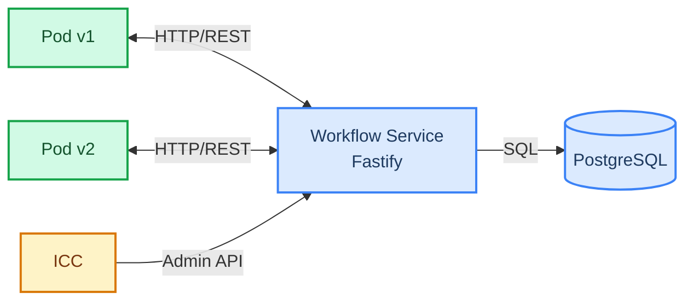

# Platformatic World

Deployment-aware workflow orchestration for self-hosted Kubernetes environments.

Platformatic World solves the version-pinning problem for [Workflow DevKit](https://docs.platformatic.dev/): when new code deploys, in-flight workflow runs must continue executing on the code version that started them. The Vercel world handles this via Vercel's infrastructure. Platformatic World provides the same guarantees for self-hosted environments by routing queue messages through a central service that pins each run to its originating deployment version.

## Architecture



Two packages:

- **`@platformatic/workflow`** (`packages/workflow/`) -- Fastify REST API that owns storage, queue routing, and deployment lifecycle. Multi-tenant with per-app isolation.
- **`@platformatic/world`** (`packages/world/`) -- Thin HTTP client implementing the `@workflow/world` `World` interface. Drop-in replacement for other world implementations.

Two e2e workbenches:

- **`e2e-v5/`** — Next.js test app pinned to `workflow@5.0.0-beta.2` SDK. Runs our Vercel-compat suite (`vercel-e2e.test.ts`, 61 ports of upstream tests) and CBOR-specific assertions. Mirrors Vercel's main-branch CI.
- **`e2e-v4/`** — Same app, pinned to `workflow@4.2.4` stable SDK. Proves `@platformatic/world` still works for users on the stable SDK line.

## Prerequisites

- Node.js >= 22.19.0
- PostgreSQL 17
- pnpm >= 10

## Quick Start

### Using npx (no clone needed)

```bash
# Start PostgreSQL
docker run -d --name workflow-pg -e POSTGRES_USER=wf -e POSTGRES_PASSWORD=wf -e POSTGRES_DB=workflow -p 5434:5432 postgres:17-alpine

# Start the workflow service
npx @platformatic/workflow postgresql://wf:wf@localhost:5434/workflow
```

### From source

```bash
# Clone and install
git clone https://github.com/platformatic/platformatic-world.git
cd platformatic-world
pnpm install

# Start PostgreSQL
docker compose up -d

# Start the workflow service (single-tenant mode, no auth)
cd packages/workflow
npx wattpm start
```

The service starts on `http://localhost:3042` by default. Without K8s, it runs in single-tenant mode — no authentication, one implicit application.

### Run a Next.js App Locally

Apps using the Vercel Workflow SDK need a queue handler registered on startup. In Kubernetes with ICC this is automatic, but for local development your app must call `world.start()` itself.

For Next.js, create an `instrumentation.ts` in your project root:

```typescript
// instrumentation.ts
export async function register() {
  if (process.env.PLT_WORLD_SERVICE_URL) {
    const { createWorld } = await import('@platformatic/world')
    const world = createWorld()
    await world.start?.()
  }
}
```

Then start your app:

```bash
WORKFLOW_TARGET_WORLD=@platformatic/world \
PLT_WORLD_SERVICE_URL=http://localhost:3042 \
PORT=3000 \
npx next start -p 3000
```

For other frameworks, call `world.start()` during your server's startup. See the [User Guide](./doc/user-guide.md#local-development-without-watt-or-icc) for details.

### Use the World Client Directly

```typescript
import { createPlatformaticWorld } from '@platformatic/world'

const world = createPlatformaticWorld({
  serviceUrl: 'http://localhost:3042',
  appId: 'default',
  deploymentVersion: 'v1',
})

// Create a workflow run
const { run } = await world.events.create(null, {
  eventType: 'run_created',
  eventData: {
    workflowName: 'my-workflow',
    deploymentId: 'v1',
    input: { key: 'value' },
  },
})

// Queue a message (routed to the correct deployment version)
await world.queue('__wkf_workflow_my-workflow', { runId: run.runId })

// Clean up
await world.close()
```

## Configuration

### Workflow Service

| Environment Variable | Default | Description |
|---|---|---|
| `DATABASE_URL` | `postgresql://wf:wf@localhost:5434/workflow` | PostgreSQL connection string |
| `PORT` | `3042` | HTTP listen port |
| `HOST` | `0.0.0.0` | HTTP listen host |
| `K8S_API_SERVER` | `https://kubernetes.default.svc` | Kubernetes API server URL (multi-tenant only) |
| `K8S_CA_CERT` | `/var/run/secrets/kubernetes.io/serviceaccount/ca.crt` | Path to K8s CA certificate (multi-tenant only) |
| `K8S_ADMIN_SERVICE_ACCOUNT` | | K8s service account with admin access, format `namespace:name` (e.g. `platformatic:icc`) |

### World Client

```typescript
interface PlatformaticWorldConfig {
  serviceUrl: string        // Workflow Service base URL
  appId: string             // Application ID
  deploymentVersion: string // Current deployment version
}
```

## Authentication

The service auto-detects its operating mode. If a K8s service account token is present, it starts in **multi-tenant mode** with authentication. Otherwise, it starts in **single-tenant mode** with no auth.

### Single-Tenant Mode (local dev)

No authentication. A single implicit application is auto-provisioned. Just set `PLT_WORLD_SERVICE_URL` and go.

### Multi-Tenant Mode (K8s)

Pods authenticate with their projected K8s ServiceAccount tokens. The service validates them via the K8s TokenReview API and maps the ServiceAccount identity to an application.

Admin endpoints (app provisioning, draining, version management) require a K8s identity configured as the admin service account via `K8S_ADMIN_SERVICE_ACCOUNT` (e.g. `platformatic:icc`).

### Multi-Tenant Isolation

Every authenticated request resolves to an `application_id`. All SQL queries include `WHERE application_id = $appId`, enforcing row-level isolation between tenants.

## API Reference

All app-scoped endpoints are prefixed with `/api/v1/apps/:appId`.

### Events

| Method | Path | Description |
|---|---|---|
| `POST` | `/runs/:runId/events` | Create an event (main write path) |
| `GET` | `/runs/:runId/events` | List events for a run |
| `GET` | `/events/by-correlation` | List events by correlation ID |

Supported event types: `run_created`, `run_started`, `run_completed`, `run_failed`, `run_cancelled`, `run_expired`, `step_created`, `step_started`, `step_completed`, `step_failed`, `step_retrying`, `hook_created`, `hook_received`, `hook_disposed`, `wait_created`, `wait_completed`.

### Runs

| Method | Path | Description |
|---|---|---|
| `GET` | `/runs/:runId` | Get run by ID |
| `GET` | `/runs` | List runs (filters: `status`, `workflowName`, `deploymentId`) |
| `POST` | `/runs/:runId/replay` | Replay a completed run (creates new run with same input, targets original version) |
| `POST` | `/runs/:runId/cancel` | Cancel a running run |
| `POST` | `/runs/:runId/wake-up` | Cancel active sleeps for a run |
| `GET` | `/workflows/:workflowName/template` | Get step template from most recent completed run (query: `deploymentId`) |

### Steps

| Method | Path | Description |
|---|---|---|
| `GET` | `/runs/:runId/steps/:stepId` | Get step by ID |
| `GET` | `/runs/:runId/steps` | List steps for a run |

### Hooks

| Method | Path | Description |
|---|---|---|
| `GET` | `/hooks/:hookId` | Get hook by ID |
| `GET` | `/hooks/by-token/:token` | Get hook by token |
| `GET` | `/hooks` | List hooks (filter: `runId`) |

### Streams

| Method | Path | Description |
|---|---|---|
| `PUT` | `/runs/:runId/streams/:name` | Write chunk(s) to a stream |
| `GET` | `/streams/:name` | Read stream chunks |
| `GET` | `/runs/:runId/streams` | List stream names for a run |

### Queue

| Method | Path | Description |
|---|---|---|
| `POST` | `/queue` | Enqueue a message |

Supports `delaySeconds` for deferred delivery and `idempotencyKey` for deduplication.

### Handlers

| Method | Path | Description |
|---|---|---|
| `POST` | `/handlers` | Register a pod's queue handler endpoints |
| `DELETE` | `/handlers/:podId` | Deregister a pod |

### Encryption

| Method | Path | Description |
|---|---|---|
| `GET` | `/encryption-key` | Get per-run encryption key (HKDF-derived) |

### Dead Letters

| Method | Path | Description |
|---|---|---|
| `GET` | `/dead-letters` | List dead-lettered messages |
| `POST` | `/dead-letters/:messageId/retry` | Retry a dead-lettered message |

### Admin Endpoints (admin access required)

| Method | Path | Description |
|---|---|---|
| `POST` | `/api/v1/apps` | Provision application |
| `POST` | `/api/v1/apps/:appId/k8s-binding` | Create K8s ServiceAccount binding |
| `DELETE` | `/api/v1/apps/:appId/k8s-binding` | Remove K8s binding |
| `GET` | `/api/v1/apps/:appId/versions/:deploymentId/status` | Get version draining status |
| `POST` | `/api/v1/apps/:appId/versions/:deploymentId/expire` | Force-expire a deployment version |
| `POST` | `/api/v1/versions/notify` | Notify version status change |
| `GET` | `/api/v1/apps/:appId/quotas` | Get quotas for an app (returns defaults if none set) |
| `PUT` | `/api/v1/apps/:appId/quotas` | Set/update quotas (`maxRuns`, `maxEventsPerRun`, `maxQueuePerMinute`) |

### Health & Observability

| Method | Path | Auth | Description |
|---|---|---|---|
| `GET` | `/ready` | No | Database connectivity check |
| `GET` | `/status` | No | Service status |
| `GET` | `/metrics` | No | Prometheus metrics |

## Queue Router

The queue router pins messages to deployment versions:

1. Each message carries a `deployment_version` from the run that created it
2. The router looks up registered handlers for that version
3. Messages are dispatched via HTTP POST to the correct pod
4. If a version is expired, messages are rejected

### Deferred Delivery

Messages with `delaySeconds > 0` are stored with `status='deferred'` and a `deliver_at` timestamp. A background poller promotes them to `pending` when due.

### Retry Logic

Failed dispatches use exponential backoff: `min(1000ms * 2^attempt, 60000ms)`, up to 10 attempts. After max attempts, messages move to `dead` status.

### Orphan Detection

The poller detects runs stuck in `running` for over 15 minutes with no queued messages, marking them as failed with an `ORPHANED` error code.

## Deployment Lifecycle (ICC Integration)

The service provides APIs for ICC to manage deployment lifecycle:

1. **Version notification** -- ICC notifies the service when a deployment version changes status (`active`, `draining`, `expired`)
2. **Draining status** -- ICC queries the service for authoritative counts of active runs, pending hooks, pending waits, and queued messages for a version
3. **Force-expire** -- ICC can force-expire a version, which cancels all in-flight runs, dead-letters queued messages, and deregisters handlers

This gives ICC a single authoritative source for "are there any non-terminal workflow runs for version X?" -- something that cannot be determined from pod heartbeats or queue depth alone, because hooks and waits are invisible at the infrastructure level.

## Quotas & Rate Limiting

Per-application quotas (configurable via the admin API or the `workflow_app_quotas` table):

| Quota | Default | Description |
|---|---|---|
| `max_runs` | 10,000 | Maximum concurrent active runs |
| `max_events_per_run` | 10,000 | Maximum events per run |
| `max_queue_per_minute` | 1,000 | Queue message rate limit per minute |

Exceeding a quota returns HTTP 429.

## Metrics

The `/metrics` endpoint returns Prometheus-compatible metrics provided by the Platformatic runtime (HTTP request duration, status codes, Node.js runtime stats).

## Development

```bash
# Start PostgreSQL (port 5434)
docker compose up -d

# Install dependencies
pnpm install

# Run all unit/integration tests (87 workflow + 12 world)
pnpm test

# Run Vercel-compatible e2e tests (57 tests — requires PostgreSQL on port 5434)
cd e2e && node --test --test-force-exit test/vercel-e2e.test.ts

# Run our own e2e tests
cd e2e && node --test --test-force-exit test/workflow.test.ts
```

### Project Structure

```
packages/
  workflow/
    cli.js                    # CLI entrypoint (npx @platformatic/workflow)
    watt.json                 # Platformatic Service configuration (dist/plugins for production)
    watt-dev.json             # Dev configuration (./plugins for local development)
    lib/
      db.ts                   # pg.Pool + Postgrator migrations
      errors.ts               # Typed HTTP errors (@fastify/error)
      quotas.ts               # Quota checks + rate limiting
      auth/
        index.ts              # Auth plugin (onRequest hook)
        k8s-token.ts          # K8s ServiceAccount token validation
    plugins/
      db.ts                   # Database + auth initialization
      auth.ts                 # Auth wiring
      apps.ts                 # App provisioning + K8s bindings
      events.ts               # Event creation (main write path)
      runs.ts                 # Run queries + workflow template API
      run-actions.ts          # Replay, cancel, wake-up
      steps.ts                # Step queries
      hooks.ts                # Hook queries
      streams.ts              # Stream read/write
      queue.ts                # Queue message ingestion
      poller.ts               # Poller lifecycle management
      encryption.ts           # Per-run encryption keys
      handlers.ts             # Pod handler registration
      draining.ts             # Version draining status + force-expire
      versions.ts             # Version status notifications
      dead-letters.ts         # Dead-letter management
      quotas.ts               # Quota admin API (GET/PUT)
    queue/
      router.ts               # Deployment-aware message routing
      dispatcher.ts           # HTTP dispatch to pods
      poller.ts               # Deferred delivery + retry + orphan detection
      retry.ts                # Exponential backoff
    migrations/
      001.do.sql              # Full schema (auth, core, queue, encryption, quotas)
    test/                     # 87 tests across 19 suites

  world/
    src/
      index.ts                # createPlatformaticWorld() + createWorld() factories
      lib/
        client.ts             # undici Pool HTTP client
        storage.ts            # Storage interface (runs, events, steps, hooks)
        queue.ts              # Queue + handler registration
        streamer.ts           # Stream read/write
        encryption.ts         # Encryption key fetching
    test/                     # 12 tests
```

## Design Document

See [PLATFORMATIC-WORLD-DESIGN.md](./PLATFORMATIC-WORLD-DESIGN.md) for the full design rationale, including:

- Why all operations go through a central service (hooks and waits are invisible at the infrastructure level)
- Deployment-aware routing semantics
- Upgrade safety guarantees
- Database schema design

See [UPGRADE-SEMANTICS.md](./UPGRADE-SEMANTICS.md) for the analysis of Workflow DevKit's deterministic replay and why version pinning is required.
