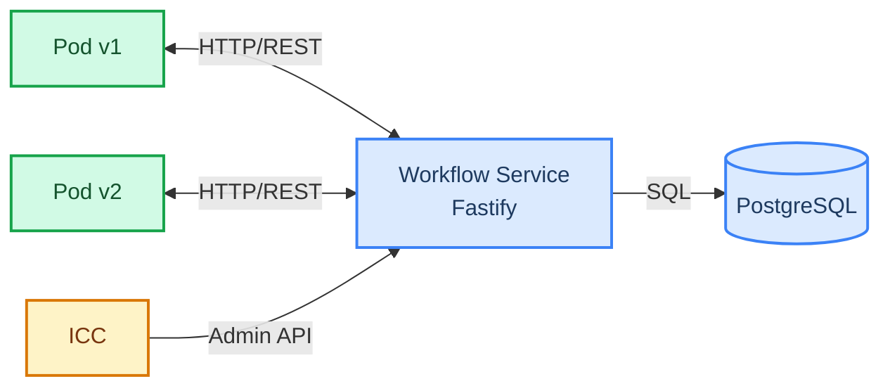

# Platformatic World

Deployment-aware workflow orchestration for self-hosted Kubernetes environments.

Platformatic World solves the version-pinning problem for [Workflow DevKit](https://docs.platformatic.dev/): when new code deploys, in-flight workflow runs must continue executing on the code version that started them. The Vercel world handles this via Vercel's infrastructure. Platformatic World provides the same guarantees for self-hosted environments by routing queue messages through a central service that pins each run to its originating deployment version.

## Architecture



Two packages:

- **`@platformatic/workflow`** (`packages/workflow/`) -- Fastify REST API that owns storage, queue routing, and deployment lifecycle. Multi-tenant with per-app isolation.
- **`@platformatic/world`** (`packages/world/`) -- Thin HTTP client implementing the `@workflow/world` `World` interface. Drop-in replacement for other world implementations.
- **`e2e/`** -- Next.js test app + end-to-end test suites (57 Vercel-compatible tests + our own integration tests).

## Prerequisites

- Node.js >= 22.19.0
- PostgreSQL 17
- pnpm >= 10

## Quick Start

```bash
# Start PostgreSQL
docker compose up -d

# Install dependencies
pnpm install

# Start the workflow service
WF_MASTER_KEY=my-secret-key node packages/workflow/src/server.ts
```

The service starts on `http://localhost:3042` by default.

### Provision an Application

```bash
# Create an application and get an API key
curl -X POST http://localhost:3042/api/v1/apps \
  -H "Authorization: Bearer my-secret-key" \
  -H "Content-Type: application/json" \
  -d '{"appId": "my-app"}'

# Response: {"appId": "my-app", "apiKey": "wfk_..."}
```

### Use the World Client

```typescript
import { createPlatformaticWorld } from '@platformatic/world'

const world = createPlatformaticWorld({
  serviceUrl: 'http://localhost:3042',
  appId: 'my-app',
  apiKey: 'wfk_...',
  deploymentVersion: 'v1',
})

// Create a workflow run
const { run } = await world.events.create(null, {
  eventType: 'run_created',
  eventData: {
    workflowName: 'my-workflow',
    deploymentId: 'v1',
    input: { key: 'value' },
  },
})

// Queue a message (routed to the correct deployment version)
await world.queue('__wkf_workflow_my-workflow', { runId: run.runId })

// Clean up
await world.close()
```

## Configuration

### Workflow Service

| Environment Variable | Default | Description |
|---|---|---|
| `DATABASE_URL` | `postgresql://wf:wf@localhost:5433/workflow` | PostgreSQL connection string |
| `WF_MASTER_KEY` | `dev-master-key` | Master key for admin endpoints |
| `WF_AUTH_MODE` | `api-key` | Authentication mode: `api-key`, `k8s-token`, or `both` |
| `PORT` | `3042` | HTTP listen port |
| `HOST` | `0.0.0.0` | HTTP listen host |
| `K8S_API_SERVER` | `https://kubernetes.default.svc` | Kubernetes API server URL (when using k8s-token auth) |
| `K8S_CA_CERT` | `/var/run/secrets/kubernetes.io/serviceaccount/ca.crt` | Path to K8s CA certificate |

### World Client

```typescript
interface PlatformaticWorldConfig {
  serviceUrl: string        // Workflow Service base URL
  appId: string             // Application ID (from provisioning)
  apiKey: string            // API key (from provisioning)
  deploymentVersion: string // Current deployment version
}
```

## Authentication

The service supports two authentication modes:

### API Key (default)

Each application gets a unique API key (`wfk_...`) issued during provisioning. Keys are stored as SHA-256 hashes. Pods send the key as `Authorization: Bearer wfk_...` on every request.

```bash
# Rotate an API key (revokes old key immediately)
curl -X POST http://localhost:3042/api/v1/apps/my-app/keys/rotate \
  -H "Authorization: Bearer $WF_MASTER_KEY"
```

### Kubernetes ServiceAccount Tokens

Pods send projected ServiceAccount tokens. The service validates them via the K8s TokenReview API and maps the ServiceAccount identity to an application.

```bash
# Create a K8s binding
curl -X POST http://localhost:3042/api/v1/apps/my-app/k8s-binding \
  -H "Authorization: Bearer $WF_MASTER_KEY" \
  -H "Content-Type: application/json" \
  -d '{"namespace": "default", "serviceAccount": "my-app-sa"}'
```

### Multi-Tenant Isolation

Every authenticated request resolves to an `application_id`. All SQL queries include `WHERE application_id = $appId`, enforcing row-level isolation between tenants.

## API Reference

All app-scoped endpoints are prefixed with `/api/v1/apps/:appId`.

### Events

| Method | Path | Description |
|---|---|---|
| `POST` | `/runs/:runId/events` | Create an event (main write path) |
| `GET` | `/runs/:runId/events` | List events for a run |
| `GET` | `/events/by-correlation` | List events by correlation ID |

Supported event types: `run_created`, `run_started`, `run_completed`, `run_failed`, `run_cancelled`, `run_expired`, `step_created`, `step_started`, `step_completed`, `step_failed`, `step_retrying`, `hook_created`, `hook_received`, `hook_disposed`, `wait_created`, `wait_completed`.

### Runs

| Method | Path | Description |
|---|---|---|
| `GET` | `/runs/:runId` | Get run by ID |
| `GET` | `/runs` | List runs (filters: `status`, `workflowName`, `deploymentId`) |

### Steps

| Method | Path | Description |
|---|---|---|
| `GET` | `/runs/:runId/steps/:stepId` | Get step by ID |
| `GET` | `/runs/:runId/steps` | List steps for a run |

### Hooks

| Method | Path | Description |
|---|---|---|
| `GET` | `/hooks/:hookId` | Get hook by ID |
| `GET` | `/hooks/by-token/:token` | Get hook by token |
| `GET` | `/hooks` | List hooks (filter: `runId`) |

### Streams

| Method | Path | Description |
|---|---|---|
| `PUT` | `/runs/:runId/streams/:name` | Write chunk(s) to a stream |
| `GET` | `/streams/:name` | Read stream chunks |
| `GET` | `/runs/:runId/streams` | List stream names for a run |

### Queue

| Method | Path | Description |
|---|---|---|
| `POST` | `/queue` | Enqueue a message |

Supports `delaySeconds` for deferred delivery and `idempotencyKey` for deduplication.

### Handlers

| Method | Path | Description |
|---|---|---|
| `POST` | `/handlers` | Register a pod's queue handler endpoints |
| `DELETE` | `/handlers/:podId` | Deregister a pod |

### Encryption

| Method | Path | Description |
|---|---|---|
| `GET` | `/encryption-key` | Get per-run encryption key (HKDF-derived) |

### Dead Letters

| Method | Path | Description |
|---|---|---|
| `GET` | `/dead-letters` | List dead-lettered messages |
| `POST` | `/dead-letters/:messageId/retry` | Retry a dead-lettered message |

### Admin Endpoints (master key required)

| Method | Path | Description |
|---|---|---|
| `POST` | `/api/v1/apps` | Provision application + issue API key |
| `POST` | `/api/v1/apps/:appId/keys/rotate` | Rotate API key |
| `POST` | `/api/v1/apps/:appId/k8s-binding` | Create K8s ServiceAccount binding |
| `DELETE` | `/api/v1/apps/:appId/k8s-binding` | Remove K8s binding |
| `GET` | `/api/v1/apps/:appId/versions/:deploymentId/status` | Get version draining status |
| `POST` | `/api/v1/apps/:appId/versions/:deploymentId/expire` | Force-expire a deployment version |
| `POST` | `/api/v1/versions/notify` | Notify version status change |

### Health & Observability

| Method | Path | Auth | Description |
|---|---|---|---|
| `GET` | `/ready` | No | Database connectivity check |
| `GET` | `/status` | No | Service status |
| `GET` | `/metrics` | No | Prometheus metrics |

## Queue Router

The queue router pins messages to deployment versions:

1. Each message carries a `deployment_version` from the run that created it
2. The router looks up registered handlers for that version
3. Messages are dispatched via HTTP POST to the correct pod
4. If a version is expired, messages are rejected

### Deferred Delivery

Messages with `delaySeconds > 0` are stored with `status='deferred'` and a `deliver_at` timestamp. A background poller promotes them to `pending` when due.

### Retry Logic

Failed dispatches use exponential backoff: `min(1000ms * 2^attempt, 60000ms)`, up to 10 attempts. After max attempts, messages move to `dead` status.

### Orphan Detection

The poller detects runs stuck in `running` for over 15 minutes with no queued messages, marking them as failed with an `ORPHANED` error code.

## Deployment Lifecycle (ICC Integration)

The service provides APIs for ICC to manage deployment lifecycle:

1. **Version notification** -- ICC notifies the service when a deployment version changes status (`active`, `draining`, `expired`)
2. **Draining status** -- ICC queries the service for authoritative counts of active runs, pending hooks, pending waits, and queued messages for a version
3. **Force-expire** -- ICC can force-expire a version, which cancels all in-flight runs, dead-letters queued messages, and deregisters handlers

This gives ICC a single authoritative source for "are there any non-terminal workflow runs for version X?" -- something that cannot be determined from pod heartbeats or queue depth alone, because hooks and waits are invisible at the infrastructure level.

## Quotas & Rate Limiting

Per-application quotas (configurable via `workflow_app_quotas` table):

| Quota | Default | Description |
|---|---|---|
| `max_runs` | 10,000 | Maximum concurrent active runs |
| `max_events_per_run` | 10,000 | Maximum events per run |
| `max_queue_per_minute` | 1,000 | Queue message rate limit per minute |

Exceeding a quota returns HTTP 429.

## Metrics

The `/metrics` endpoint returns Prometheus-compatible metrics:

- **Counters**: `wf_events_created_total`, `wf_runs_created_total`, `wf_messages_dispatched_total`, `wf_messages_dead_lettered_total`, `wf_messages_retried_total`
- **Gauges**: `wf_active_runs`, `wf_queue_depth`, `wf_db_pool_total`, `wf_db_pool_idle`
- **Summaries**: `wf_request_duration_ms`, `wf_queue_dispatch_duration_ms` (with p50, p95, p99 quantiles)

## Development

```bash
# Start PostgreSQL (port 5434)
docker compose up -d

# Install dependencies
pnpm install

# Run all unit/integration tests (71 workflow + 10 world)
pnpm test

# Run Vercel-compatible e2e tests (57 tests — requires PostgreSQL on port 5434)
cd e2e && node --test --test-force-exit test/vercel-e2e.test.ts

# Run our own e2e tests
cd e2e && node --test --test-force-exit test/workflow.test.ts
```

### Project Structure

```
packages/
  workflow/
    src/
      app.ts                  # buildApp() factory
      server.ts               # CLI entrypoint
      lib/
        db.ts                 # pg.Pool + Postgrator migrations
        errors.ts             # Typed HTTP errors (@fastify/error)
        auth/
          index.ts            # Auth plugin (onRequest hook)
          api-key.ts          # API key validation
          k8s-token.ts        # K8s ServiceAccount token validation
          master-key.ts       # Master key comparison
      plugins/
        apps.ts               # App provisioning
        events.ts             # Event creation (main write path)
        runs.ts               # Run queries
        steps.ts              # Step queries
        hooks.ts              # Hook queries
        streams.ts            # Stream read/write
        queue.ts              # Queue message ingestion
        encryption.ts         # Per-run encryption keys
        handlers.ts           # Pod handler registration
        draining.ts           # Version draining status + force-expire
        versions.ts           # Version status notifications
        dead-letters.ts       # Dead-letter management
        quotas.ts             # Quota checks + rate limiting
        metrics.ts            # Prometheus /metrics endpoint
        health.ts             # Health checks
      queue/
        router.ts             # Deployment-aware message routing
        dispatcher.ts         # HTTP dispatch to pods
        poller.ts             # Deferred delivery + retry + orphan detection
        retry.ts              # Exponential backoff
      migrations/
        001.do.sql            # Core schema
        002.do.sql            # Hook status columns
        003.do.sql            # Quotas table
    test/                     # 71 tests across 16 suites

  world/
    src/
      index.ts                # createPlatformaticWorld() factory
      lib/
        client.ts             # undici Pool HTTP client
        storage.ts            # Storage interface (runs, events, steps, hooks)
        queue.ts              # Queue + createQueueHandler
        streamer.ts           # Stream read/write
        encryption.ts         # Encryption key fetching
    test/                     # 5 integration tests
```

## Design Document

See [PLATFORMATIC-WORLD-DESIGN.md](./PLATFORMATIC-WORLD-DESIGN.md) for the full design rationale, including:

- Why all operations go through a central service (hooks and waits are invisible at the infrastructure level)
- Deployment-aware routing semantics
- Upgrade safety guarantees
- Database schema design

See [UPGRADE-SEMANTICS.md](./UPGRADE-SEMANTICS.md) for the analysis of Workflow DevKit's deterministic replay and why version pinning is required.
