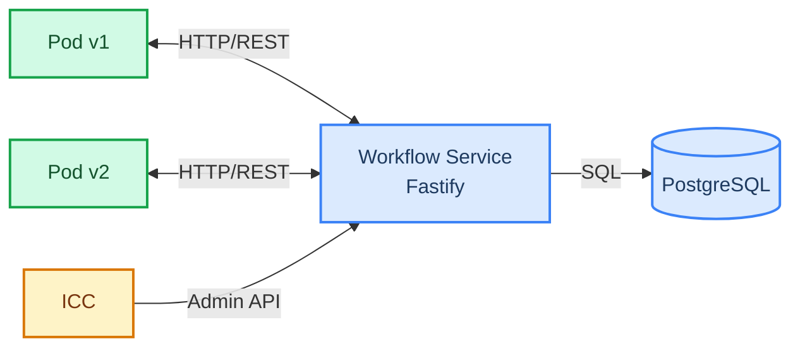

# Platformatic World

Deployment-aware workflow orchestration for self-hosted Kubernetes environments.

Platformatic World solves the version-pinning problem for [Workflow DevKit](https://docs.platformatic.dev/): when new code deploys, in-flight workflow runs must continue executing on the code version that started them. The Vercel world handles this via Vercel's infrastructure. Platformatic World provides the same guarantees for self-hosted environments by routing queue messages through a central service that pins each run to its originating deployment version.

## Architecture



## Packages

- **`@platformatic/workflow`** (`packages/workflow/`) -- Fastify REST API that owns storage, queue routing, and deployment lifecycle. Multi-tenant with per-app isolation.
- **`@platformatic/world`** (`packages/world/`) -- Thin HTTP client implementing the `@workflow/world` `World` interface. Drop-in replacement for other world implementations.
- **`@platformatic/workflow-fastify`** (`packages/workflow-fastify/`) -- Optional Fastify plugin that mounts standalone-build handlers and registers the queue handler on boot. For non-Next.js hosts.

## Operating Modes

`@platformatic/world` and the Workflow Service run in **two distinct modes**.
The service auto-detects which one based on the presence of a Kubernetes
service-account token. Apps just point `PLT_WORLD_SERVICE_URL` at the
service URL and use the same SDK in both modes.

| Aspect | Local mode (single-tenant) | Kubernetes mode (with ICC) |
|---|---|---|
| Triggered by | No K8s service-account token detected | K8s service-account token present at runtime |
| Authentication | None | K8s `TokenReview` per request |
| Apps | One implicit app (`default`) auto-provisioned | One app per K8s ServiceAccount binding, provisioned by ICC |
| Pod-to-handler registration | App calls `world.start()` on boot | ICC registers handlers via the admin API; `world.start()` is a no-op |
| Deployment version | Defaults to `local` (or `PLT_WORLD_DEPLOYMENT_VERSION`) | Auto-detected from the pod's `plt.dev/version` label |
| Admin API | Open (no auth) | Restricted to the configured admin ServiceAccount (e.g. `platformatic:icc`) |
| Run-pinning across deploys | Yes (every run records the version that started it) | Yes (same mechanism; ICC drives version lifecycle) |

**Local mode** is what you use for development, CI, and the e2e tests in
this repo. It runs the same code paths as production -- only the auth and
handler-registration entry points differ.

**Kubernetes mode** is the production deployment under
[ICC](https://github.com/platformatic/intelligent-command-center). ICC is
the control plane: it provisions apps, binds K8s ServiceAccounts to apps,
registers pod handler endpoints, and drives version lifecycle (drain /
expire). The service itself is identical between the two modes.

The diagram at the top shows the K8s-with-ICC mode. In local mode, replace
the ICC box with nothing -- the service runs standalone against PostgreSQL
and accepts unauthenticated traffic from apps on the same machine.

## Prerequisites

- Node.js >= 22.19.0
- PostgreSQL 17
- pnpm >= 10

## Local Mode Quick Start

The fastest path: run the service via `npx`, point a Next.js app at it.

### 1. Start the Workflow Service

#### Option A: `npx` (no clone needed)

```bash
# Start PostgreSQL
docker run -d --name workflow-pg \
  -e POSTGRES_USER=wf -e POSTGRES_PASSWORD=wf -e POSTGRES_DB=workflow \
  -p 5434:5432 postgres:17-alpine

# Start the workflow service
npx @platformatic/workflow postgresql://wf:wf@localhost:5434/workflow
```

#### Option B: From source

```bash
git clone https://github.com/platformatic/platformatic-world.git
cd platformatic-world
pnpm install

docker compose up -d              # PostgreSQL on port 5434

cd packages/workflow
npx wattpm start                  # single-tenant mode (no auth)
```

The service starts on `http://localhost:3042`. Migrations run automatically
on first start. Single-tenant mode is detected automatically because no K8s
service-account token is present.

### 2. Wire Your App to the Service

In local mode the app must call `world.start()` once on boot to register
its callback endpoints with the service. (In K8s + ICC, ICC handles this
and `world.start()` becomes a no-op.)

For Next.js, create `instrumentation.ts` in your project root:

```typescript
// instrumentation.ts
export async function register () {
  if (process.env.PLT_WORLD_SERVICE_URL) {
    const { createWorld } = await import('@platformatic/world')
    const world = createWorld()
    await world.start?.()
  }
}
```

Then start your app:

```bash
WORKFLOW_TARGET_WORLD=@platformatic/world \
PLT_WORLD_SERVICE_URL=http://localhost:3042 \
PORT=3000 \
npx next start -p 3000
```

For other frameworks (Express, Koa, Fastify, plain Node), call
`world.start()` from your server bootstrap. For Fastify specifically,
[`@platformatic/workflow-fastify`](packages/workflow-fastify/) does this
plus mounts the standalone-build handlers.

### 3. (Optional) Use the World Client Directly

For low-level scripting or tests, skip the SDK and drive the world client
directly:

```typescript
import { createPlatformaticWorld } from '@platformatic/world'

const world = createPlatformaticWorld({
  serviceUrl: 'http://localhost:3042',
  appId: 'default',
  deploymentVersion: 'v1',
})

// Create a workflow run
const { run } = await world.events.create(null, {
  eventType: 'run_created',
  eventData: {
    workflowName: 'my-workflow',
    deploymentId: 'v1',
    input: { key: 'value' },
  },
})

// Queue a message (routed to the correct deployment version)
await world.queue('__wkf_workflow_my-workflow', { runId: run.runId })

await world.close()
```

## Kubernetes Mode (with ICC)

In production the Workflow Service runs as a Kubernetes Deployment, fronted
by ICC (the Platformatic control plane). The setup differs from local mode
in three ways:

1. **Service detects K8s automatically.** When the pod has a projected
   service-account token at
   `/var/run/secrets/kubernetes.io/serviceaccount/token`, the service
   starts in multi-tenant mode. No flag is needed.
2. **ICC provisions and binds apps.** Apps are created via
   `POST /api/v1/apps` and bound to a K8s ServiceAccount via
   `POST /api/v1/apps/:appId/k8s-binding`. Pods then authenticate with
   their projected token; the service validates it via the K8s
   `TokenReview` API and maps it to the bound app.
3. **ICC registers pod handlers and drives the version lifecycle.** Pods
   do not call `world.start()` themselves -- ICC posts to
   `POST /api/v1/apps/:appId/handlers` when a pod is ready, and drains /
   expires versions via the admin API as deploys roll out.

Required environment for the service in K8s mode:

| Variable | Description |
|---|---|
| `DATABASE_URL` | PostgreSQL connection string |
| `K8S_ADMIN_SERVICE_ACCOUNT` | The ICC ServiceAccount, e.g. `platformatic:icc` |
| `K8S_API_SERVER` | Defaults to `https://kubernetes.default.svc` |
| `K8S_CA_CERT` | Defaults to the in-pod CA path |

App pods only need:

```
WORKFLOW_TARGET_WORLD=@platformatic/world
PLT_WORLD_SERVICE_URL=http://workflow-service.<namespace>.svc.cluster.local:3042
```

`PLT_WORLD_APP_ID` is resolved from the pod's ServiceAccount binding;
`PLT_WORLD_DEPLOYMENT_VERSION` is read from the pod's `plt.dev/version`
label. Both can be overridden explicitly if needed.

Production deployment is owned by ICC (see the
[ICC repo](https://github.com/platformatic/intelligent-command-center) and
the [Deployment Lifecycle section](#deployment-lifecycle-icc-integration)
below for the contract between the service and ICC). This repo does not
ship K8s manifests.

## Configuration

### Workflow Service

| Environment Variable | Default | Description |
|---|---|---|
| `DATABASE_URL` | `postgresql://wf:wf@localhost:5434/workflow` | PostgreSQL connection string |
| `PORT` | `3042` | HTTP listen port |
| `HOST` | `0.0.0.0` | HTTP listen host |
| `K8S_API_SERVER` | `https://kubernetes.default.svc` | Kubernetes API server URL (multi-tenant only) |
| `K8S_CA_CERT` | `/var/run/secrets/kubernetes.io/serviceaccount/ca.crt` | Path to K8s CA certificate (multi-tenant only) |
| `K8S_ADMIN_SERVICE_ACCOUNT` | | K8s service account with admin access, format `namespace:name` (e.g. `platformatic:icc`) |

### World Client

```typescript
interface PlatformaticWorldConfig {
  serviceUrl: string        // Workflow Service base URL
  appId: string             // Application ID
  deploymentVersion: string // Current deployment version
}
```

## Authentication

The service auto-detects its operating mode. If a K8s service account token is present, it starts in **multi-tenant mode** with authentication. Otherwise, it starts in **single-tenant mode** with no auth.

### Single-Tenant Mode (local dev)

No authentication. A single implicit application is auto-provisioned. Just set `PLT_WORLD_SERVICE_URL` and go.

### Multi-Tenant Mode (K8s)

Pods authenticate with their projected K8s ServiceAccount tokens. The service validates them via the K8s TokenReview API and maps the ServiceAccount identity to an application.

Admin endpoints (app provisioning, draining, version management) require a K8s identity configured as the admin service account via `K8S_ADMIN_SERVICE_ACCOUNT` (e.g. `platformatic:icc`).

### Multi-Tenant Isolation

Every authenticated request resolves to an `application_id`. All SQL queries include `WHERE application_id = $appId`, enforcing row-level isolation between tenants.

## API Reference

All app-scoped endpoints are prefixed with `/api/v1/apps/:appId`.

### Events

| Method | Path | Description |
|---|---|---|
| `POST` | `/runs/:runId/events` | Create an event (main write path) |
| `GET` | `/runs/:runId/events` | List events for a run |
| `GET` | `/events/by-correlation` | List events by correlation ID |

Supported event types: `run_created`, `run_started`, `run_completed`, `run_failed`, `run_cancelled`, `run_expired`, `step_created`, `step_started`, `step_completed`, `step_failed`, `step_retrying`, `hook_created`, `hook_received`, `hook_disposed`, `wait_created`, `wait_completed`.

### Runs

| Method | Path | Description |
|---|---|---|
| `GET` | `/runs/:runId` | Get run by ID |
| `GET` | `/runs` | List runs (filters: `status`, `workflowName`, `deploymentId`) |
| `POST` | `/runs/:runId/replay` | Replay a completed run (creates new run with same input, targets original version) |
| `POST` | `/runs/:runId/cancel` | Cancel a running run |
| `POST` | `/runs/:runId/wake-up` | Cancel active sleeps for a run |
| `GET` | `/workflows/:workflowName/template` | Get step template from most recent completed run (query: `deploymentId`) |

### Steps

| Method | Path | Description |
|---|---|---|
| `GET` | `/runs/:runId/steps/:stepId` | Get step by ID |
| `GET` | `/runs/:runId/steps` | List steps for a run |

### Hooks

| Method | Path | Description |
|---|---|---|
| `GET` | `/hooks/:hookId` | Get hook by ID |
| `GET` | `/hooks/by-token/:token` | Get hook by token |
| `GET` | `/hooks` | List hooks (filter: `runId`) |

### Streams

| Method | Path | Description |
|---|---|---|
| `PUT` | `/runs/:runId/streams/:name` | Write chunk(s) to a stream |
| `GET` | `/streams/:name` | Read stream chunks |
| `GET` | `/runs/:runId/streams` | List stream names for a run |

### Queue

| Method | Path | Description |
|---|---|---|
| `POST` | `/queue` | Enqueue a message |

Supports `delaySeconds` for deferred delivery and `idempotencyKey` for deduplication.

### Handlers

| Method | Path | Description |
|---|---|---|
| `POST` | `/handlers` | Register a pod's queue handler endpoints |
| `DELETE` | `/handlers/:podId` | Deregister a pod |

### Encryption

| Method | Path | Description |
|---|---|---|
| `GET` | `/encryption-key` | Get per-run encryption key (HKDF-derived) |

### Dead Letters

| Method | Path | Description |
|---|---|---|
| `GET` | `/dead-letters` | List dead-lettered messages |
| `POST` | `/dead-letters/:messageId/retry` | Retry a dead-lettered message |

### Admin Endpoints (admin access required)

| Method | Path | Description |
|---|---|---|
| `POST` | `/api/v1/apps` | Provision application |
| `POST` | `/api/v1/apps/:appId/k8s-binding` | Create K8s ServiceAccount binding |
| `DELETE` | `/api/v1/apps/:appId/k8s-binding` | Remove K8s binding |
| `GET` | `/api/v1/apps/:appId/versions/:deploymentId/status` | Get version draining status |
| `POST` | `/api/v1/apps/:appId/versions/:deploymentId/expire` | Force-expire a deployment version |
| `POST` | `/api/v1/versions/notify` | Notify version status change |
| `GET` | `/api/v1/apps/:appId/quotas` | Get quotas for an app (returns defaults if none set) |
| `PUT` | `/api/v1/apps/:appId/quotas` | Set/update quotas (`maxRuns`, `maxEventsPerRun`, `maxQueuePerMinute`) |

### Health & Observability

| Method | Path | Auth | Description |
|---|---|---|---|
| `GET` | `/ready` | No | Database connectivity check |
| `GET` | `/status` | No | Service status |
| `GET` | `/metrics` | No | Prometheus metrics |

## Queue Router

The queue router pins messages to deployment versions:

1. Each message carries a `deployment_version` from the run that created it
2. The router looks up registered handlers for that version
3. Messages are dispatched via HTTP POST to the correct pod
4. If a version is expired, messages are rejected

### Deferred Delivery

Messages with `delaySeconds > 0` are stored with `status='deferred'` and a `deliver_at` timestamp. A background poller promotes them to `pending` when due.

### Retry Logic

Failed dispatches use exponential backoff: `min(1000ms * 2^attempt, 60000ms)`, up to 10 attempts. After max attempts, messages move to `dead` status.

### Orphan Detection

The poller detects runs stuck in `running` for over 15 minutes with no queued messages, marking them as failed with an `ORPHANED` error code.

## Deployment Lifecycle (ICC Integration)

The service provides APIs for ICC to manage deployment lifecycle:

1. **Version notification** -- ICC notifies the service when a deployment version changes status (`active`, `draining`, `expired`)
2. **Draining status** -- ICC queries the service for authoritative counts of active runs, pending hooks, pending waits, and queued messages for a version
3. **Force-expire** -- ICC can force-expire a version, which cancels all in-flight runs, dead-letters queued messages, and deregisters handlers

This gives ICC a single authoritative source for "are there any non-terminal workflow runs for version X?" -- something that cannot be determined from pod heartbeats or queue depth alone, because hooks and waits are invisible at the infrastructure level.

## Quotas & Rate Limiting

Per-application quotas (configurable via the admin API or the `workflow_app_quotas` table):

| Quota | Default | Description |
|---|---|---|
| `max_runs` | 10,000 | Maximum concurrent active runs |
| `max_events_per_run` | 10,000 | Maximum events per run |
| `max_queue_per_minute` | 1,000 | Queue message rate limit per minute |

Exceeding a quota returns HTTP 429.

## Metrics

The `/metrics` endpoint returns Prometheus-compatible metrics provided by the Platformatic runtime (HTTP request duration, status codes, Node.js runtime stats).

## Testing

All tests run against the **local mode** of the Workflow Service (no K8s,
no ICC) backed by PostgreSQL on port 5434 from `docker-compose.yml`. K8s
mode is exercised in the ICC integration suite, not here.

```bash
# Start PostgreSQL (port 5434)
docker compose up -d

# Install dependencies
pnpm install

# Run unit + integration tests across the three packages
pnpm test
```

`pnpm test` runs:
- `@platformatic/workflow` -- service unit and integration tests (database,
  auth, queue routing, draining, quotas, etc.)
- `@platformatic/world` -- world client unit tests
- `@platformatic/workflow-fastify` -- Fastify plugin tests

### E2E Workbenches

The repo ships **two Next.js workbenches** that exercise the full stack --
real Next.js app, real Workflow SDK, real `@platformatic/world` adapter,
real Workflow Service over HTTP -- pinned to different SDK versions:

| Workbench | SDK version | Purpose |
|---|---|---|
| [`e2e-v5/`](e2e-v5/) | `workflow@5.0.0-beta.2` | Mirrors Vercel's main-branch CI. Hosts our Vercel-compat suite (61 ports of upstream tests) and the CBOR-specific assertions. |
| [`e2e-v4/`](e2e-v4/) | `workflow@4.2.4` (stable) | Guards the v4 runtime path so stable-SDK users keep working. |

Both workbenches share the same workflow sources and helper, only the
`workflow` / `@workflow/*` versions in `package.json` differ.

Each test run boots:
1. The Workflow Service via `wattpm start` (random port per run).
2. The Next.js app via `next start` (random port per run).
3. Truncates the database between suites for isolation.

Run from the repo root:

```bash
# Local-suite e2e against v5 beta SDK
pnpm test:e2e:v5

# Local-suite e2e against v4 stable SDK
pnpm test:e2e:v4

# Vercel-compat suite (v5 workbench, ports of upstream tests)
pnpm test:e2e:vercel
```

Or run a single file directly:

```bash
cd e2e-v5
node --test --test-force-exit test/workflow.test.ts
node --test --test-force-exit test/vercel-e2e.test.ts
```

CI runs all three suites (`pnpm test:e2e:v4`, `pnpm test:e2e:v5`,
`pnpm test:e2e:vercel`) on every PR.

#### What each suite covers

- **`workflow.test.ts`** (both workbenches) -- our own e2e cases: hook
  resume, retries, replay, cancel, streams, multi-step pipelines.
- **`cbor-e2e.test.ts`** (both workbenches) -- CBOR queue-transport
  assertions; verifies `Uint8Array` survives a queue round-trip without
  base64 wrapping.
- **`vercel-e2e.test.ts`** (v5 only) -- 61 ports of Vercel's
  community-world upstream tests; proves the Platformatic world is a
  drop-in for Vercel's own integration matrix.
- **`compat.test.ts`** (v4 only) -- compatibility guards specific to the
  v4 stable line (older streamer API shape, etc.).

See [`e2e-v5/README.md`](e2e-v5/README.md) for the
`WORKFLOW_PUBLIC_MANIFEST=1` build flag and other workbench-specific
notes.

### Project Structure

```
packages/
  workflow/
    cli.js                    # CLI entrypoint (npx @platformatic/workflow)
    watt.json                 # Platformatic Service configuration (dist/plugins for production)
    watt-dev.json             # Dev configuration (./plugins for local development)
    lib/
      db.ts                   # pg.Pool + Postgrator migrations
      errors.ts               # Typed HTTP errors (@fastify/error)
      quotas.ts               # Quota checks + rate limiting
      auth/
        index.ts              # Auth plugin (onRequest hook)
        k8s-token.ts          # K8s ServiceAccount token validation
    plugins/
      db.ts                   # Database + auth initialization
      auth.ts                 # Auth wiring
      apps.ts                 # App provisioning + K8s bindings
      events.ts               # Event creation (main write path)
      runs.ts                 # Run queries + workflow template API
      run-actions.ts          # Replay, cancel, wake-up
      steps.ts                # Step queries
      hooks.ts                # Hook queries
      streams.ts              # Stream read/write
      queue.ts                # Queue message ingestion
      poller.ts               # Poller lifecycle management
      encryption.ts           # Per-run encryption keys
      handlers.ts             # Pod handler registration
      draining.ts             # Version draining status + force-expire
      versions.ts             # Version status notifications
      dead-letters.ts         # Dead-letter management
      quotas.ts               # Quota admin API (GET/PUT)
    queue/
      router.ts               # Deployment-aware message routing
      dispatcher.ts           # HTTP dispatch to pods
      poller.ts               # Deferred delivery + retry + orphan detection
      retry.ts                # Exponential backoff
    migrations/
      001.do.sql              # Full schema (auth, core, queue, encryption, quotas)
    test/                     # 87 tests across 19 suites

  world/
    src/
      index.ts                # createPlatformaticWorld() + createWorld() factories
      lib/
        client.ts             # undici Pool HTTP client
        storage.ts            # Storage interface (runs, events, steps, hooks)
        queue.ts              # Queue + handler registration
        streamer.ts           # Stream read/write
        encryption.ts         # Encryption key fetching
    test/                     # 12 tests
```

## Design Document

See [PLATFORMATIC-WORLD-DESIGN.md](./PLATFORMATIC-WORLD-DESIGN.md) for the full design rationale, including:

- Why all operations go through a central service (hooks and waits are invisible at the infrastructure level)
- Deployment-aware routing semantics
- Upgrade safety guarantees
- Database schema design

See [UPGRADE-SEMANTICS.md](./UPGRADE-SEMANTICS.md) for the analysis of Workflow DevKit's deterministic replay and why version pinning is required.
